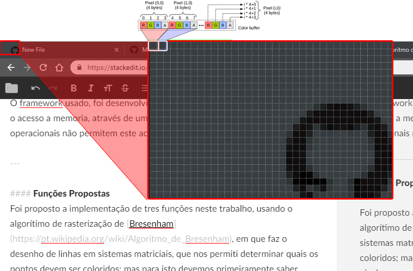
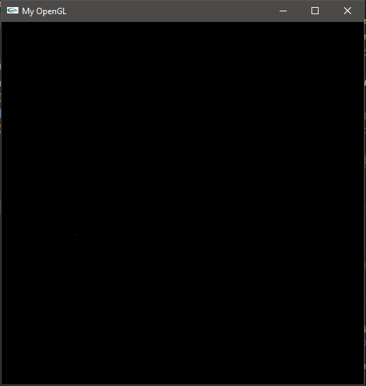
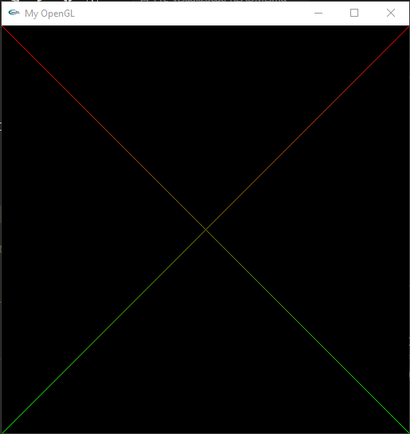

# Computer-Graphics-UFPB
---

# Menu
* [Introdução](#introdução)
* [Framework](#framework)
* [Funções Propostas](#funções-propostas)
	* [PutPixel](#PutPixel)
	* [DrawLine](#DrawLine)
	* [DrawTriangle](#DrawTriangle)
* [Conclusão](#conclusão)
* [Referencias](#referencias)
---

## Introdução
Este artigo é destinado ao primeiro trabalho da DISCIPLINA de Introdução a Computação Gráfica, ministrada pelo professor Christian Azambuja Pagot, o qual desenvolveu a framework em uso.

---

## Framework
O framework usado, foi desenvolvido pelo professor Christian, ao qual simula o acesso a memoria, através de um ponteiro FBptr, já que os sistemas operacionais não permitem este acesso.

---

### Funções Propostas
Foi proposto a implementação de trés funções neste trabalho, usando o algorítimo de rasterização de [Bresenham](https://pt.wikipedia.org/wiki/Algoritmo_de_Bresenham), em que faz o desenho de linhas em sistemas matriciais, que nos permiti determinar quais os pontos devem ser coloridos; mas para isto devemos primeiramente saber desenhar um ponto, um pixel.
Isto nos leva a primeira função, "PutPixel"

#### PutPixel
Para se desenhar um pixel, primeiro devemos entender o que é um pixel. Pixel é o menor elemento em um dispositivo de exibição (como por exemplo o monitor), em que podemos designar uma cor, como em uma imagem digital, ele é o menor ponto que forma uma imagem.

<p align="center">
	<br>
	
	<h5 align="center">Figure 1 - pixel</h5>
	<br>
</p>

No nosso caso, cada pixel recebe 4 bytes como informações de cor, uma para o vermelho, uma para o azul , uma para o verde e o alfa, que controla a transparência do nosso pixel. Os pixel são endereçados na memoria, como pontos de coordenadas (x,y), levando em conta que a o número de pixels na tela é dado pela multiplicação de número de linhas pelo número de colunas, a memória deve ter esta mesma quantidade de posições para representar a tela, só que de forma linear.

Agora que sabemos o que é um pixel e como ele é endereçado, veremos como desenha-lo em C++, utilizando a framework já citada.

```C++
void  MyGlDraw(void)
{
	// ***********************************************************
	// Chame aqui as funções do mygl.h
	// ***********************************************************
	CGDraw CG;
	tuple <int,int,int,int>  RGBA1 (255,0,0,255); //vermelho
	tuple <int,int>  XY1 (100,100); //Posição

	CG.PutPixel(XY1,RGBA1);
}
```

```C++
void  CGDraw::PutPixel(tuple<int, int> XY, tuple<int, int, int, int> RGBA)
{
	int R, G, B, A;
	int x, y;

	tie(R, G, B, A) = RGBA;
	tie(x, y) = XY;
	if (x > IMAGE_WIDTH || x <  0  || y > IMAGE_HEIGHT || y <  0)//verifica se ta desenhando fora
		return;
	
	FBptr[(4  * x) + (4  * y * IMAGE_HEIGHT) +  0] = R; // componente R
	FBptr[(4  * x) + (4  * y * IMAGE_HEIGHT) +  1] = G; // componente G
	FBptr[(4  * x) + (4  * y * IMAGE_HEIGHT) +  2] = B; // componente B
	FBptr[(4  * x) + (4  * y * IMAGE_HEIGHT) +  3] = A; // componente A
}
```
A função a cima recebe:
1. XY é a posição a ser desenhada na tela.
2. RGBA informações de cor.


<p align="center">
	<br>
	
	<h5 align="center">Figure 2 - Pixel vermelho desenhado na tela</h5>
	<br>
</p>

---

#### DrawLine
Para rasterizar linhas, teremos que conectar dois pontos, com isto para desenhar linhas verticais, horizontais ou diagonais é somente pintar os pixels que nela passam. Assim surge um problema, quando a reta não exatamente se intersecciona com apenas um pixel, devemos usar o [algorítimo de Bresenham](https://pt.wikipedia.org/wiki/Algoritmo_de_Bresenham)

Agora o maior desafio esta em em identificar quais pixels devem ser coloridos, tendo somente o inicial e o final. O algorítimo interativo, tem base na variável de decisão calculada na iteração anterior, na sequência a variável de decisão é incrementada de acordo com o valor do pixel escolhido.

```C++
void CGDraw::DrawLine(tuple<int, int> XYi, tuple<int, int> XYf,
                      tuple<int, int, int, int> RGBAi, tuple<int, int, int, int> RGBAf)
{
    int x1, y1, x2, y2,
        R, G, B, A, R2, G2, B2, A2,
        Dx, Dy,
        y, x,
        c;
    float cAng, mx, my, D, distance, TotalDistance;
    bool flag[3]; //lowHigh,X1,Y1

    tie(x1, y1) = XYi;
    tie(x2, y2) = XYf;
    tie(R, G, B, A) = RGBAi;
    tie(R2, G2, B2, A2) = RGBAf;
    tie(x1, y1) = XYi;
    tie(x2, y2) = XYf;

    flag[0] = (abs(y2 - y1) < abs(x2 - x1));
    flag[1] = (x1 > x2);
    flag[2] = (y1 > y2);

    if (flag[1]) //faz a troca se um dos pontos iniciai for maior que o final
    {
        swap(x1, y1, x2, y2);
    }

    Dx = (x2 - x1);
    Dy = (y2 - y1);

    //termo independente
    c = -x1 * y2 + x2 * y1;
    //coeficiente angular
    cAng = (float)Dy / Dx;
    //coeficientes angulares
    mx = x1 + 1.0;
    my = y1 + (cAng >= 0 ? 0.5 : -0.5);
    D = -Dx * my + Dy * mx + c;

    y = y1;
    x = x1;

    TotalDistance = getLength(x1, y1, x2, y2);
    for (x = x1; x < x2; x++)
    {
        distance = getLength(x, y, x2, y2) / TotalDistance;
        PutPixel(make_tuple(x, y), InterpolarCor(RGBAi, RGBAf, distance));
        if (D > 0)
        {
            //SE escolhido se cAng>=0, E escolhido se cAng<0
            if (cAng >= 0)
            {
                y++;
                D -= Dx;
            }
        }
        else
        { //E escolhido se cAng>=0, NE escolhido se cAng<0
            if (cAng < 0)
            {
                y--;
                D += Dx;
            }
        }
        D += Dy;
    }
}
```

<p align="center">
	<br>
	
	<h5 align="center">Figure 3 - Linha desenhada com Bresenham</h5>
	<br>
</p>

---

#### DrawTriangle
Depois de resolver o problema de rasterizar linhas, para se desenhar triângulos ficou fácil, basta somente desenhar trés linhas, formando assim um triangulo.
```C++
void CGDraw::DrawTriangle(
    tuple<int, int> XY1, 
    tuple<int, int> XY2, 
    tuple<int, int> XY3,
    tuple<int, int, int, int> RGBA1,
    tuple<int, int, int, int> RGBA2,
    tuple<int, int, int, int> RGBA3
    )
{
    DrawLine(XY1, XY2, RGBA2, RGBA1);
    DrawLine(XY2, XY3, RGBA2, RGBA3);
    DrawLine(XY3, XY1, RGBA3, RGBA1);
}
```
<p align="center">
	<br>
	
	<h5 align="center">Figure 4 - Representação de um triangulo</h5>
	<br>
</p>

---

## Conclusão
### Resultados
Como ficou bem visível, o projeto apresentou resultados satisfatórios, pois e capaz de desenhar pontos, retas e triângulos, ou qualquer forma geométrica composta por eles, alem de interpolar as cores entre os pontos.

### Desafios encontrados
O grande desafio, foi o entendimento do conceito do algoritmo de Bresenham, apos isto, foi somente usar uma técnica que permita desenhar em todos os quadrantes da tela.

---

### References

https://en.wikipedia.org/wiki/Bresenham%27s_line_algorithm
http://www.univasf.edu.br/~jorge.cavalcanti/comput_graf04_prim_graficas2.pdf
https://www.tutorialspoint.com/computer_graphics/line_generation_algorithm.htm
https://github.com/ThiagoLuizNunes/CG-Assignments/tree/master/cg_framework
https://abraaoallyssonec.blogspot.com/2015/07/rasterizacao-de-primitivas-em-c.html

---

Toolkit: OpenGL | Glut | Computer Graphic | C++

## Requirements ###

* *[A Unix Environment](https://www.ubuntu.com/)** :white_check_mark:
* *[C++ Compiler with support for standard C11]()** :white_check_mark: